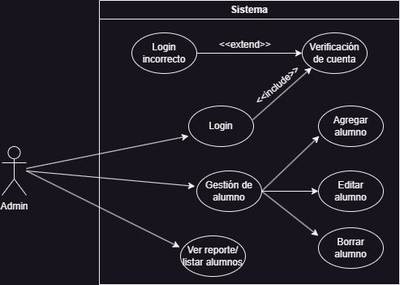

# API de Registro de Estudiantes

Esta API se encarga de gestionar el registro de estudiantes en un sistema académico. 
El objetivo principal, de acuerdo al caso de uso a desarrollar, es permitir que los administradores del sistema realicen operaciones relacionadas con la gestión de estudiantes.
En un eventual desarrollo del mismo, los padres podrían ingresar al sistema y podrían observar detalles del alumno relacionado.
 
## Caso de Uso del Administrador
El caso de uso principal de esta API se enfoca en las funciones y operaciones que un **administrador** puede realizar. A continuación, se describen las funcionalidades disponibles para el administrador:
 

### Autenticación
El administrador debe iniciar sesión, proporcionando sus credenciales. 
 

### Obtener lista de alumnos
Una vez autenticado, puede solicitar la lista de todos los alumnos registrados en la base de datos. 
 

### Agregar alumno
El administrador puede agregar un nuevo alumno a la base de datos, enviando los datos del mismo en el endpoint `/agregaralumno`. El servidor valida y almacena la información del alumno.
 

### Editar alumno
Si el administrador requiere modificar información existente sobre un alumno, puede hacerlo en el endpoint `/editaralumnos`. Debe proporcionar los nuevos datos del alumno y el servidor actualiza la información en la base de datos.
 

### Borrar alumno
El administrador puede eliminar a un alumno de la base de datos, usando el endpoint `/editaralumnos`.
 

 

## Correr la aplicación
#
 
Para correr nuestra aplicación, el usuario tiene que asegurarse que tiene instalado Docker en su máquina. Luego ejecutar el comando 
`docker-compose up -d`

Luego, acceder a la URL: 
`url de railway`
 

## Librerías utilizadas
Nuestra aplicación utiliza las siguientes librerías:
 

**Dependencies**

Server
- react
- react-dom
- react-bootstrap
- react-router-dom
- react-scripts
- sweetalert2
- uniqid
- web-vitals

Cliente
- bcrypt
- bcryptjs
- cookie-parse
- cookie-parser
- cors
- dotenv
- express
- jsonwebtoken
- mongoose
 

**Dev-Dependencies**
- Nodemon

